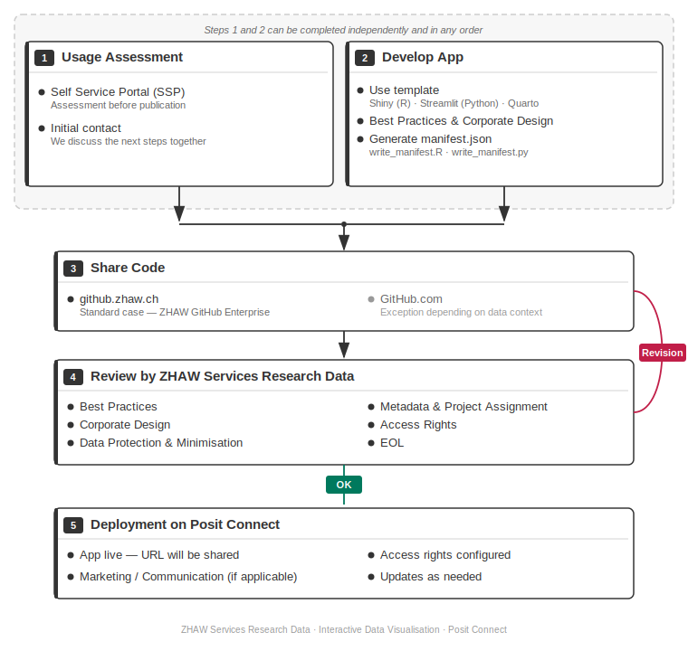

# Process Overview

This page describes the full process – from developing an app to publishing it on Posit Connect.

## Process Summary

The steps at a glance:

1. **Usage assessment** — Check via the Self Service Portal (SSP)
2. **Develop your app** — Use our template or integrate an existing app
3. **Share your code** — Provide source code on github.zhaw.ch
4. **Feedback & deployment** — We review the code and deploy the app

## Detailed Description

### Step 1: Usage Assessment

<!-- TODO: Short description + link to usage assessment page -->

### Step 2: Develop Your App

<!-- TODO: Short description + link to app development section -->

### Step 3: Share Your Code

<!-- TODO: Short description + link to code sharing section -->

### Step 4: Feedback & Deployment

<!-- TODO: Short description + link to deployment page -->
